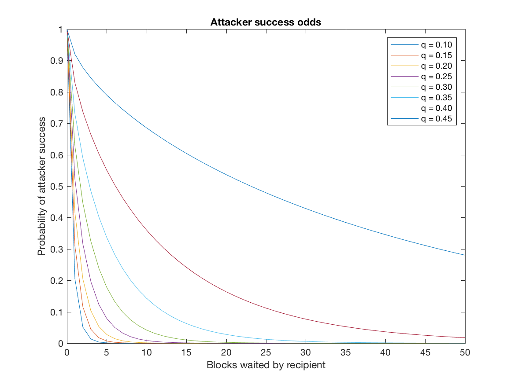

A simple script to reproduce the attacker success probability simulations 
described at the end of the [bitcoin paper](https://bitcoin.org/bitcoin.pdf).

These simulations produce the figure below:

